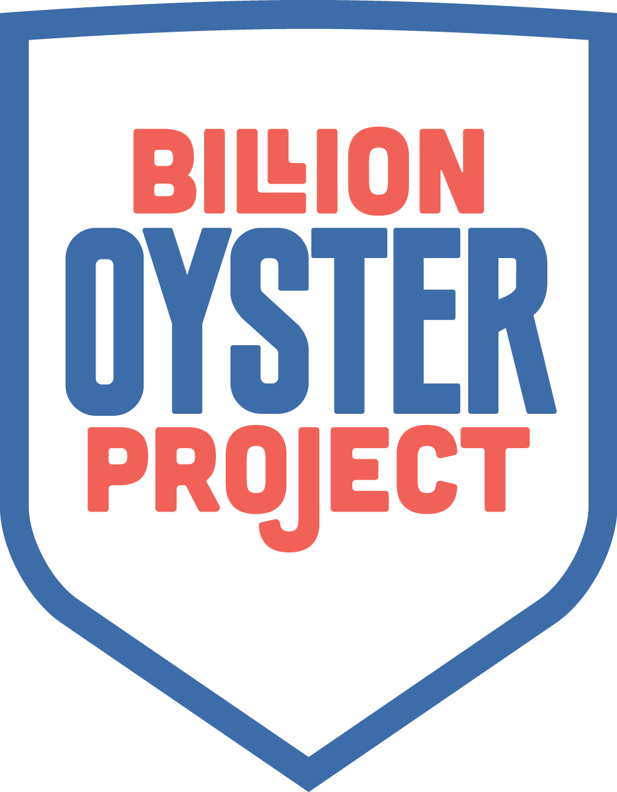

# Billion Oyster Project Data Parser

___
<h2>What is this?</h2>

This is a tool to quickly help data analysts to quickly get informational results
from the Billion Oyster Project ORS Database.
___
<h2>How it works</h2>

This tool utilizes csvkit to parse through data (graph-cli is still being implemented!)
___

<h2>How to install it</h2>

	<h3>Dependencies:</h3>

**CSVKit:** <code>sudo pip install csvkit</code>

**graph-cli:** <code>sudo pip install graph-cli</code>

**Clone-Repo:** <code>git clone https://github.com/Chernbog/BOP-Helper.git</code>

___

<h2>Future Roadmap</h2>

<h4>May 12th First Update:</h4>

**Stage 1:** Create script that takes user input and searches the Year, Month, Broodstock, with no Location specified and Shows the average shell height of the month.

**Stage 2:** Create script that takes user input and searches the Year, Month, Broodstock and 1 Location Shows the average shell height of that location

**Stage 3:** Create script that takes user input and searches the Year, Month, Broodstock and 1 Location Shows the average shell height of that location. Shows th

*To be continued*
